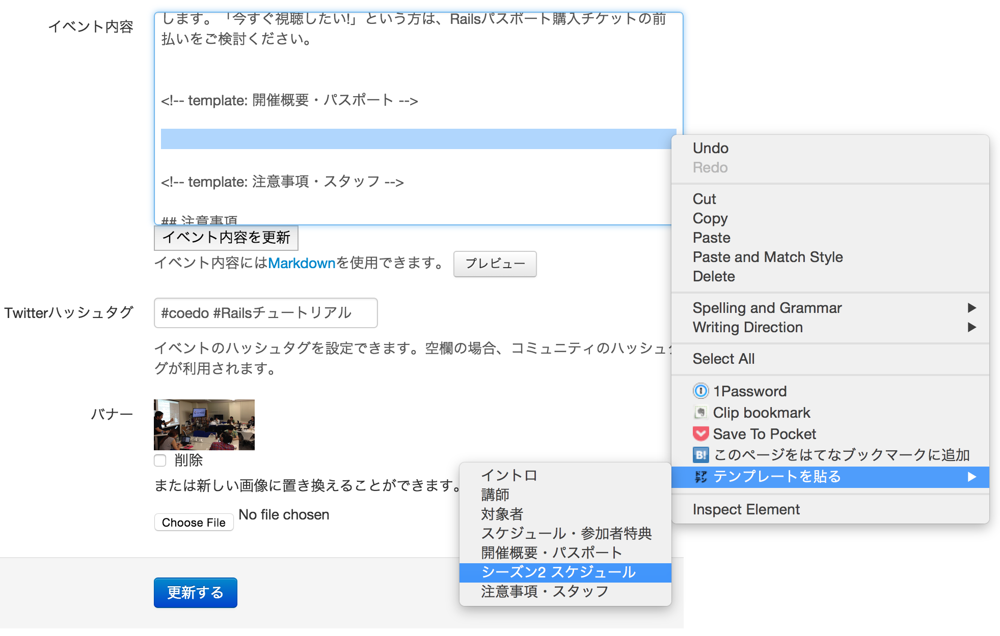
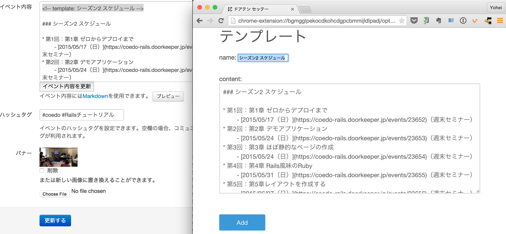
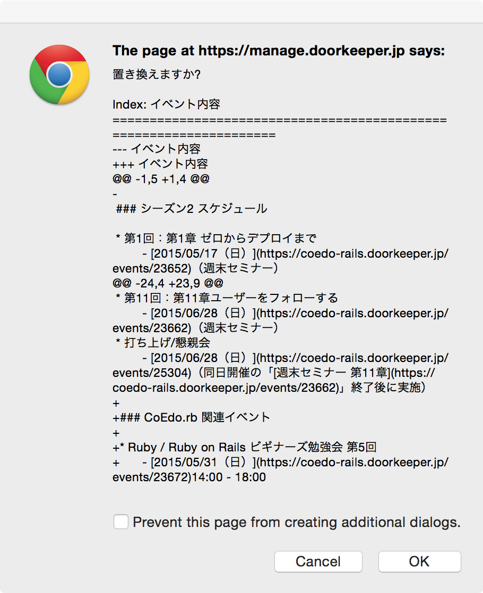

ドアテン
========

Doorkeeperのイベント内容の一部分をテンプレートみたいにしてボタン一発で更新できるChrome extension

[ドアテン - Chrome ウェブストア](https://chrome.google.com/webstore/detail/%E3%83%89%E3%82%A2%E3%83%86%E3%83%B3/bgmgglpekocdkohcdgpcbmmijldlpadj)

使い方
-----

## 1. テンプレートを貼る


## 2. テンプレートを更新する


## 3. テンプレートの部分を置き換える


開発
----

```console
$ npm install -g grunt-cli
$ git clone https://github.com/yasslab/event-description-template.git
$ cd event-description-template
$ npm install
$ npm install -g bower
$ bower install
$ grunt watch
```

Chromeの拡張機能設定画面から「パッケージ化されていない拡張機能を読み込む」で`app`ディレクトリを選択する。


ライセンス
---------

Copyright &copy; 2015 [YassLab](http://yasslab.jp)

The extension is available as open source under the terms of the [MIT License](http://opensource.org/licenses/MIT).
